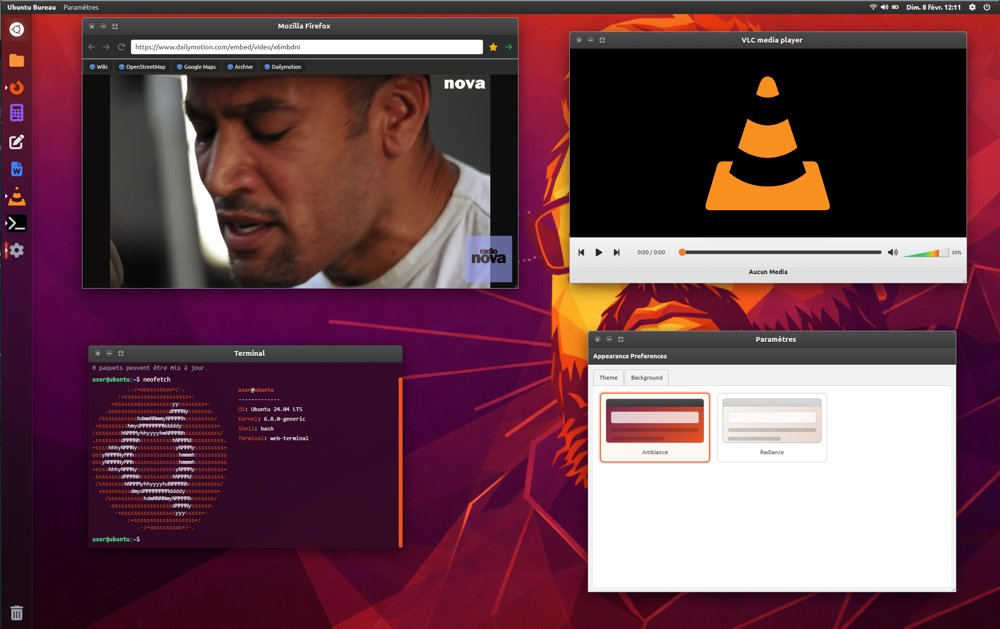
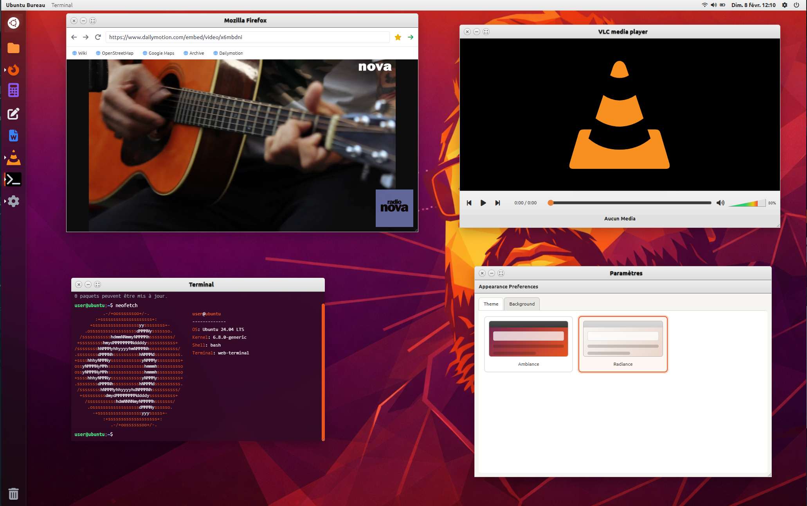

# 🚀 Phoenix OS - Web Desktop Environment

**Phoenix OS** est une simulation d'environnement de bureau (Web Desktop) inspirée par l'interface **Ubuntu Unity**. Ce projet a été conçu pour offrir une expérience multitâche fluide.


## Captures

| Ambiance | Radiance |
|---|---|
|  |  |


## 🌟 Fonctionnalités

Phoenix OS intègre plusieurs applications inspirées de l’écosystème Ubuntu, réécrites entièrement en HTML, CSS et JavaScript. Elles ne sont pas de simples maquettes: chacune possède une logique propre et s’intègre au gestionnaire de fenêtres.

- **Nautilus** (Gestionnaire de fichiers)
Explorateur de fichiers basé sur un système de fichiers virtuel (VFS).
Navigation par dossiers, affichage en grille, détection des types de fichiers (audio, image), gestion des covers de dossiers et ouverture contextuelle des applications (VLC, visionneuse d’images, éditeur de texte).
- **Terminal**
Terminal simulé permettant d’exécuter des commandes courantes (ls, cd, cat, sudo apt update, etc.).
Gestion du prompt, historique des commandes, et comportements réalistes inspirés d’Ubuntu.
- **VLC Media Player**
Lecteur audio intégré avec playlist automatique par dossier.
Support de la lecture directe depuis Nautilus, barre de progression, gestion du volume, bouton précédent intelligent (restart / piste précédente), covers d’album via cover.jpg et design inspiré de VLC avec dégradés orange.
- **Mozilla Firefox**
Navigateur web embarqué basé sur des iFrames.
Gestion des favoris, historique de navigation et compatibilité avec les sites adaptés aux environnements sandboxés.
- **Gedit (éditeur de texte)**
Éditeur de texte simple pour visualiser et modifier des fichiers du VFS.
Pensé comme un outil léger, fidèle a l’esprit de Gedit.
- **Writer**
Traitement de texte minimaliste orienté écriture, distinct de l’éditeur brut.
Idéal pour des contenus longs ou narratifs.
- **Calculatrice**
Calculatrice fonctionnelle intégrée au bureau, utilisable dans une fenêtre indépendante.
- **Paramètres système**
Panneau de configuration simulé pour centraliser les réglages de l’environnement (apparence, comportements, options futures).
- **Horloge**
Application horloge affichant l’heure et servant de base a de futures extensions (alarme, minuterie).
- **Corbeille**
Gestion des fichiers supprimés au sein du VFS, avec possibilité d’évolution vers une restauration.
- **Menu d’alimentation**
Menu simulant les actions système (éteindre, redémarrer), purement visuel mais intégré a l’UX globale.

## 🛠️ Installation & Déploiement

Le projet est purement "Front-end" (HTML/JS/CSS). Aucun serveur backend n'est requis.

1. Clonez le dépôt :
   ```bash
   git clone https://github.com/Paullux/phoenix-os.git

2. Ouvrez index.html dans votre navigateur ou déployez-le sur GitHub Pages.

## 📝 Configuration du Navigateur (Firefox App)
Pour une expérience optimale, il est recommandé d'utiliser des sites compatibles avec les iFrames (comme Wikipédia, OpenStreetMap ou la version embed Dailymotion).

## 📄 Licence
[Ce projet est sous licence GNU GPL v3. Voir le fichier LICENSE.md pour plus de détails.](LICENSE.md)

*Développé avec passion par un passioné en quête d'uptime.*